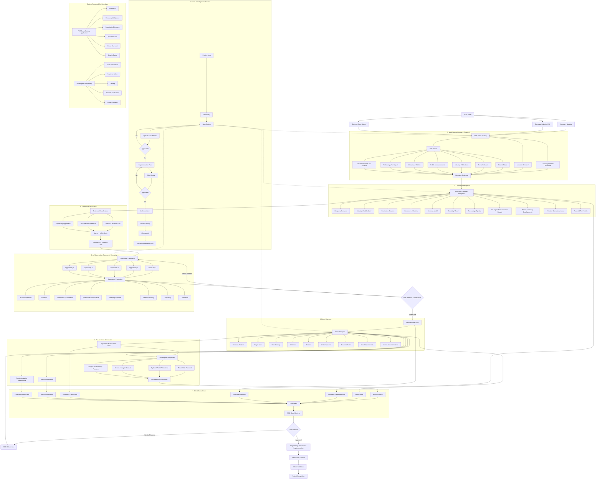

# FDE Demo Factory Workflow

```mermaid
flowchart TD

    %% =========================
    %% INPUT
    %% =========================
    A["FDE / User"] --> B["Company Website"]
    A --> C["Company LinkedIn URL"]
    A --> D["Optional Client Notes"]

    B --> E["FDE Demo Factory"]
    C --> E
    D --> E

    %% =========================
    %% RESEARCH
    %% =========================
    subgraph RESEARCH["1. Multi-Source Company Research"]
        E --> F["Company Website Research"]
        E --> G["LinkedIn Research"]
        E --> H["Web Search"]
        
        H --> H1["Recent News"]
        H --> H2["Press Releases"]
        H --> H3["Industry Publications"]
        H --> H4["Public Announcements"]
        H --> H5["Interviews / Articles"]
        H --> H6["Technology / AI Signals"]
        H --> H7["Other Credible Public Sources"]
        
        F --> I["Research Evidence"]
        G --> I
        H1 --> I
        H2 --> I
        H3 --> I
        H4 --> I
        H5 --> I
        H6 --> I
        H7 --> I
    end

    %% =========================
    %% COMPANY INTELLIGENCE
    %% =========================
    subgraph INTELLIGENCE["2. Company Intelligence"]
        I --> J["Structured Company Intelligence"]
        
        J --> J1["Company Overview"]
        J --> J2["Industry / Sub-Industry"]
        J --> J3["Products & Services"]
        J --> J4["Customers / Markets"]
        J --> J5["Business Model"]
        J --> J6["Operating Model"]
        J --> J7["Technology Signals"]
        J --> J8["AI / Digital Transformation Signals"]
        J --> J9["Recent Company Developments"]
        J --> J10["Potential Operational Areas"]
        J --> J11["Potential Pain Points"]
    end

    %% =========================
    %% EVIDENCE
    %% =========================
    subgraph EVIDENCE["3. Evidence & Trust Layer"]
        J --> K["Evidence Classification"]
        
        K --> K1["Publicly Observed Fact"]
        K --> K2["AI-Generated Inference"]
        K --> K3["Opportunity Hypothesis"]
        
        K1 --> L["Source + URL + Date"]
        K2 --> L
        K3 --> L
        
        L --> M["Confidence / Evidence Level"]
    end

    %% =========================
    %% OPPORTUNITY DISCOVERY
    %% =========================
    subgraph OPPORTUNITIES["4. AI / Automation Opportunity Discovery"]
        M --> N["Opportunity Generation"]
        
        N --> O1["Opportunity 1"]
        N --> O2["Opportunity 2"]
        N --> O3["Opportunity 3"]
        N --> O4["Opportunity 4"]
        N --> O5["Opportunity 5"]
        
        O1 --> P["Opportunity Evaluation"]
        O2 --> P
        O3 --> P
        O4 --> P
        O5 --> P
        
        P --> P1["Business Problem"]
        P --> P2["Evidence"]
        P --> P3["Potential AI / Automation"]
        P --> P4["Potential Business Value"]
        P --> P5["Data Requirements"]
        P --> P6["Demo Feasibility"]
        P --> P7["Complexity"]
        P --> P8["Confidence"]
    end

    %% =========================
    %% FDE DECISION
    %% =========================
    P --> Q{"FDE Reviews Opportunities"}

    Q -->|Reject / Refine| N
    Q -->|Select One| R["Selected Use Case"]

    %% =========================
    %% DEMO BLUEPRINT
    %% =========================
    subgraph BLUEPRINT["5. Demo Blueprint"]
        R --> S["Demo Blueprint"]
        
        S --> S1["Business Problem"]
        S --> S2["Target User"]
        S --> S3["User Journey"]
        S --> S4["Workflow"]
        S --> S5["Screens"]
        S --> S6["AI Components"]
        S --> S7["Business Rules"]
        S --> S8["Data Requirements"]
        S --> S9["Demo Success Criteria"]
    end

    %% =========================
    %% FUTURE DEMO GENERATION
    %% =========================
    subgraph DEMO["6. Future Demo Generation"]
        S --> T["Synthetic / Public Demo Data"]
        S --> U["Demo Architecture"]
        S --> V["Productionization Architecture"]
        
        T --> W["Build Agent / Antigravity"]
        S --> W
        
        W --> X["React / Vite Frontend"]
        W --> Y["Python / FastAPI Backend"]
        W --> Z["Gemini / Google Cloud AI"]
        W --> AA["Google Cloud Storage / Firestore"]
        
        X --> AB["Clickable Mini-Application"]
        Y --> AB
        Z --> AB
        AA --> AB
    end

    %% =========================
    %% DEMO PACK
    %% =========================
    subgraph DEMOPACK["7. Client Demo Pack"]
        AB --> AC["Working Demo"]
        S --> AD["Demo Script"]
        J --> AE["Company Intelligence Brief"]
        R --> AF["Selected Use Case"]
        T --> AG["Synthetic / Public Data"]
        U --> AH["Demo Architecture"]
        V --> AI["Productionization Path"]
        
        AC --> AJ["Demo Pack"]
        AD --> AJ
        AE --> AJ
        AF --> AJ
        AG --> AJ
        AH --> AJ
        AI --> AJ
        
        AJ --> AK["FDE Client Meeting"]
    end

    %% =========================
    %% CLIENT APPROVAL
    %% =========================
    AK --> AL{"Client Decision"}

    AL -->|Needs Changes| AM["FDE Refinement"]
    AM --> S

    AL -->|Approved| AN["Engineering / Production Implementation"]

    AN --> AO["Production Solution"]
    AO --> AP["Client Validation"]
    AP --> AQ["Project Completion"]

    %% =========================
    %% GENESIS DEVELOPMENT PROCESS
    %% =========================
    subgraph GENESIS["Genesis Development Process"]
        G1["Product Idea"] --> G2["Discovery"]
        G2 --> G3["Specification"]
        G3 --> G4["Specification Review"]
        G4 --> G5{"Approved?"}
        G5 -->|No| G3
        G5 -->|Yes| G6["Implementation Plan"]
        G6 --> G7["Plan Review"]
        G7 --> G8{"Approved?"}
        G8 -->|No| G6
        G8 -->|Yes| G9["Implementation"]
        G9 --> G10["Proof / Testing"]
        G10 --> G11["Checkpoint"]
        G11 --> G12["Next Implementation Slice"]
    end

    %% =========================
    %% CURRENT PHASE
    %% =========================
    G3 -.-> E
    G3 -.-> J
    G3 -.-> N
    G3 -.-> S

    %% =========================
    %% ARCHITECTURE BOUNDARY
    %% =========================
    subgraph BOUNDARY["System Responsibility Boundary"]
        BA["FDE Demo Factory Application"]
        BB["Build Agent / Antigravity"]
        
        BA --> BA1["Research"]
        BA --> BA2["Company Intelligence"]
        BA --> BA3["Opportunity Discovery"]
        BA --> BA4["FDE Selection"]
        BA --> BA5["Demo Blueprint"]
        BA --> BA6["Quality Gates"]
        
        BB --> BB1["Code Generation"]
        BB --> BB2["Implementation"]
        BB --> BB3["Testing"]
        BB --> BB4["Browser Verification"]
        BB --> BB5["Project Artifacts"]
    end
```
